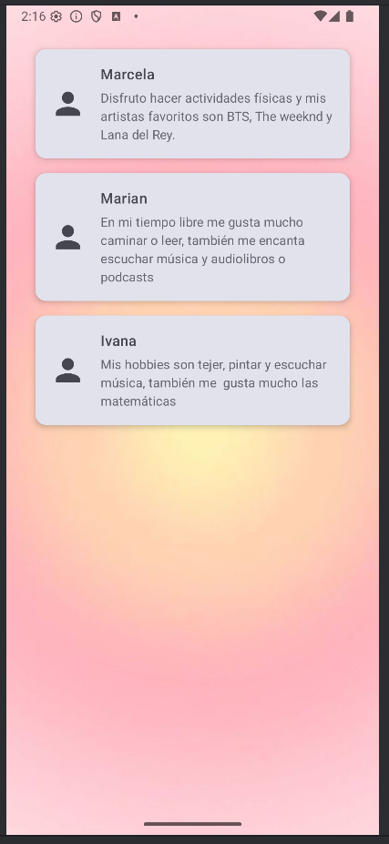

# TeamApp - Ejercicio de GitHub con Android y Compose

## 🎯 Objetivo
Este ejercicio tiene como objetivo practicar **colaboración con Git y GitHub** dentro de un proyecto Android nativo con **Kotlin y Jetpack Compose**.  
Los estudiantes trabajarán en equipo, utilizando ramas, commits, Pull Requests y revisiones de código, simulando un flujo de trabajo real.

## 🚀 Instrucciones
1. Crea un fork del repositorio de GitHub y clonalo en tu computadora.
2. Crea una rama con tu nombre o con el nombre de la funcionalidad que te corresponda (ejemplo: `feature/nombre-lista`).
3. Implementa la parte del proyecto que te fue asignada (modelo, repositorio, UI, etc.).
4. Haz commits pequeños y descriptivos de tus cambios.
5. Abre un Pull Request (PR) hacia la rama `develop`. Otro compañero debe revisarlo antes de hacer merge.
6. Una vez que todas las *features* estén integradas en `develop`, el equipo debe abrir un PR final hacia `main` del repositorio original.
7. El repositorio debe incluir:
    - Capturas de pantalla de la app corriendo (lista y detalle).
    - Evidencias de los PRs y revisiones de código.
    - Una breve reflexión en este README sobre lo aprendido.

## 📂 Estructura del proyecto
- `MainActivity.kt`: Contiene la pantalla inicial con un mensaje de bienvenida.
- `strings.xml`: Archivo de recursos de texto.
- `develop` branch: Rama donde se integrarán las features antes de pasar a `main`.

## 📝 Entrega
Al finalizar:
- Agrega en este README:
    - Capturas de pantalla de la app funcionando.
    - Explicación de cómo resolvieron los conflictos y organizaron el flujo de trabajo.
    - Reflexión del equipo sobre lo aprendido.

-Resultado Final.

-Reflexión

Aplicamos con el uso del PullRequest a tener una mejor organización de trabajo y revisar nuestro código conforme lo vamo implementando a la rama develop, también la importancia de colocar nobres y descripciones significativas en los commits y pullRequest,
asi comprender que se está implementando al programa.

Los pullRequest permitió prevenir conflictos antes de implementar los cambios a develop y considerar el tiempo para finalizar con un feature y continuar con otro, asi no crear conflictos de estar trabajando todos los miembros al mismo tiempo.
